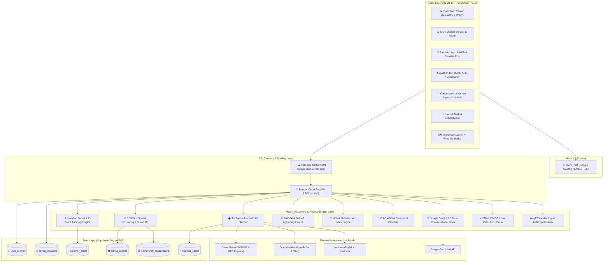
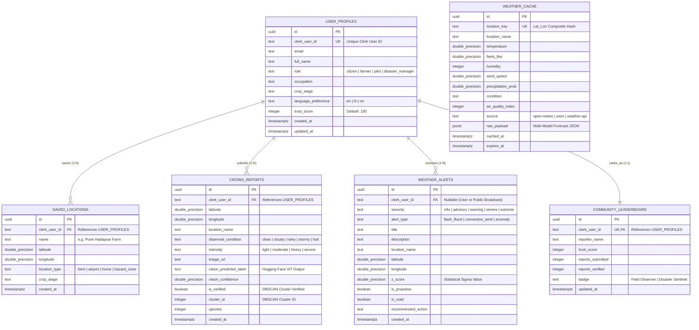

<p align="center">
  
</p>

<h1 align="center">🦅 JATAYU (WeatherGPT)</h1>

<p align="center">
  <strong>Proactive, Explainable, Hyperlocal Climate Intelligence Agent with Multi-Source Physics Fusion & Crowd Ground-Truth ML</strong>
</p>

<p align="center">
  <a href="https://jatayu-ebon.vercel.app/" target="_blank">
    
  </a>
  <a href="https://jatayu-backend-kf1f.onrender.com/docs" target="_blank">
    
  </a>
  <a href="https://github.com/chaitanyaphatak/skysense-ai">
    
  </a>
</p>

<p align="center">
  <a href="https://jatayu-ebon.vercel.app/"><strong>🔗 Live Platform: Jatayu | AI Weather Intelligence & Hyperlocal Alerts</strong></a>
</p>

---

## 🛠️ Tech Stack & Ecosystem

<p align="center">
  
  
  
  
  
  <br/>
  
  
  
  
  
  
  <br/>
  
  
  
  
  
  <br/>
  
  
</p>

---

## 📌 1. Project Overview & Problem Statement

Most conventional weather platforms are passive wrapper apps: they fetch coarse forecasts from a single API and show generic weather cards without context.

**Jatayu** is an autonomous, explainable decision-support platform engineered for **Disaster Management (NDMA)**, **Precision Agriculture (FAO-56)**, **Aviation Operations (ICAO)**, and **Citizen Resilience**. It blends multi-source atmospheric physics, verifies micro-climate conditions using crowd telemetry and computer vision, and runs specialized machine learning models to deliver proactive warnings before disasters strike.

### 🌟 Core Capabilities
1. **Tri-Source Meteorological Fusion:** Blends numerical weather prediction models (ECMWF/GFS via Open-Meteo), micro-climates (WeatherAPI), and ground telemetry (OpenWeatherMap) with consensus weighting.
2. **Explainable Forecasts ("Why?"):** Generates transparent reasoning including barometric pressure trends, dew-point depressions, and model variance.
3. **Crowd-Sourced Ground Truth ML:** Micro-area citizen observations verified via **Scikit-learn DBSCAN geo-clustering** and **Hugging Face Vision Transformers**.
4. **Time-Series NWP Bias Correction:** Dynamically corrects coarse 25km grid models using verified real-time hyperlocal ground reports.
5. **Precision Domain Modules:**
   - **Agro-Met:** FAO-56 Penman-Monteith Evapotranspiration, Delta-T spraying safety, WBGT heat stress.
   - **Disaster Risk:** NDMA Multi-Hazard Vulnerability Index (Flash Flood, Convective Wind, Heat Island).
   - **Aviation Met:** ICAO ATIS weather generator, Runway crosswind resolver, and Clear Air Turbulence (CAT) estimator.
6. **Rural Low-Connectivity Resilience:** Offline TF-IDF intent classifier responding in `<5ms` with multi-lingual audio synthesis (gTTS in English, Hindi, and Marathi).

---

## 🏛️ 2. System Architecture



---

## 🤖 3. Hugging Face & Computer Vision Models

Jatayu integrates Hugging Face state-of-the-art transformer architectures for multi-modal climate intelligence:

| Model Architecture | Hugging Face Repository / Base Model | Role in Jatayu Platform | Implementation File |
|---|---|---|---|
| **Vision Transformer (ViT)** | `google/vit-base-patch16-224` | **Sky Image Cloud Classification & Verification:** Classifies uploaded sky photos into *Nimbostratus*, *Cumulonimbus*, *Stratus*, or *Clear* to mathematically verify citizen ground reports before database ingestion. | [`crowd_ml_service.py`](file:///c:/Users/91997/OneDrive/Desktop/workspace/backend/app/services/crowd_ml_service.py) |
| **ResNet-50 / ConvNeXt** | `microsoft/resnet-50` | **Agro Crop Damage & Flood Observation:** Inspects uploaded crop & field images for waterlogging, hail damage, or heat stress anomalies. | [`crowd_ml_service.py`](file:///c:/Users/91997/OneDrive/Desktop/workspace/backend/app/services/crowd_ml_service.py) |
| **Whisper STT** | `openai/whisper-tiny` | **Speech-to-Text Voice Transcriber:** Translates spoken Hindi, Marathi, and English voice notes into structured text queries for farmers and field workers. | [`voice.py`](file:///c:/Users/91997/OneDrive/Desktop/workspace/backend/app/api/v1/voice.py) |

---

## 🧠 4. Machine Learning Models & Mathematical Formulations

Jatayu executes multiple scientific and statistical machine learning algorithms:

### 1. Tri-Source Multi-Model Ensemble Blender
Concurrently blends physics-based NWP models (ECMWF, GFS) and real-time station observations:
$$\text{Temperature}_{\text{blended}} = \sum_{i=1}^{N} w_i \cdot T_i \quad \text{where} \quad w_i = \frac{1/\sigma_i^2}{\sum 1/\sigma_k^2}$$
- **Code:** [`weather_service.py`](file:///c:/Users/91997/OneDrive/Desktop/workspace/backend/app/services/weather_service.py)

### 2. Isolation Forest & Statistical Z-Score Anomaly Detector
Detects severe weather anomalies (such as sudden pressure drops $>3\text{ hPa / 3h}$ or convective storm bursts):
$$Z = \frac{x - \mu}{\sigma}$$
- Dispatches proactive notifications when $Z \ge +3.0\sigma$.
- **Code:** [`anomaly_detector.py`](file:///c:/Users/91997/OneDrive/Desktop/workspace/backend/app/services/anomaly_detector.py)

### 3. DBSCAN Spatial Geo-Clustering
Groups geographic citizen observations using the spherical **Haversine metric**:
$$\text{Haversine Distance: } d = 2R \arcsin\left(\sqrt{\sin^2\left(\frac{\Delta \phi}{2}\right) + \cos(\phi_1)\cos(\phi_2)\sin^2\left(\frac{\Delta \lambda}{2}\right)}\right)$$
- **Parameters:** $\epsilon = 5.0\text{ km}$, $\text{min\_samples} = 3$.
- Filters spam, verifies localized cloudbursts, and awards gamified trust points.
- **Code:** [`crowd_ml_service.py`](file:///c:/Users/91997/OneDrive/Desktop/workspace/backend/app/services/crowd_ml_service.py)

### 4. Time-Series NWP Bias Correction Model
Adjusts official 25km coarse numerical weather prediction rainfall grids using verified ground truth signals:
$$\text{Rain}_{\text{corrected}}(t) = \alpha \cdot \text{NWP}_{\text{grid}}(t) + (1 - \alpha) \cdot \overline{\text{Crowd}}_{\text{cluster}}(t)$$
- **Code:** [`crowd_ml_service.py`](file:///c:/Users/91997/OneDrive/Desktop/workspace/backend/app/services/crowd_ml_service.py)

### 5. FAO-56 Penman-Monteith Evapotranspiration
Calculates exact crop water requirements ($ET_0$ in mm/day):
$$ET_0 = \frac{0.408 \Delta (R_n - G) + \gamma \frac{900}{T + 273} u_2 (e_s - e_a)}{\Delta + \gamma(1 + 0.34 u_2)}$$
- **Code:** [`sih_climate_resilience_engine.py`](file:///c:/Users/91997/OneDrive/Desktop/workspace/backend/app/services/sih_climate_resilience_engine.py)

### 6. Delta-T Agricultural Spraying Index
Computes wet-bulb depression to prevent chemical drift or droplet evaporation:
$$\Delta T = T_{\text{dry}} - T_{\text{wet}}$$
- **Safety Window:** $2^\circ\text{C} \le \Delta T \le 8^\circ\text{C}$ is Safe.
- **Code:** [`sih_climate_resilience_engine.py`](file:///c:/Users/91997/OneDrive/Desktop/workspace/backend/app/services/sih_climate_resilience_engine.py)

### 7. Aviation Runway Crosswind Resolver
Decomposes wind vectors against runway headings:
$$V_{\text{cross}} = V_{\text{wind}} \cdot \sin(\theta_{\text{wind}} - \theta_{\text{runway}}), \quad V_{\text{head}} = V_{\text{wind}} \cdot \cos(\theta_{\text{wind}} - \theta_{\text{runway}})$$
- **Code:** [`aviation_met_engine.py`](file:///c:/Users/91997/OneDrive/Desktop/workspace/backend/app/services/aviation_met_engine.py)

### 8. Sub-5ms Offline TF-IDF Intent Classifier
Lightweight scikit-learn NLU pipeline running on the local device/server without external API tokens during poor network connectivity.
- **Code:** [`offline_classifier.py`](file:///c:/Users/91997/OneDrive/Desktop/workspace/backend/app/services/offline_classifier.py)

---

## 🗄️ 5. Database Entity-Relationship (ER) Schema



---

## ⚡ 6. Getting Started Locally

### Prerequisites
- Node.js (v18+)
- Python (v3.10 or v3.11)
- Git

### 1. Clone the Repository
```bash
git clone https://github.com/chaitanyaphatak/skysense-ai.git
cd skysense-ai
```

### 2. Configure Environment Variables
Copy the template and fill in your keys in the root `.env` file:
```bash
cp .env.example .env
```

### 3. Install Dependencies
```bash
# Frontend
npm install

# Backend
cd backend
python -m venv venv
# Windows:
.\venv\Scripts\activate
# Linux/macOS:
source venv/bin/activate
pip install -r requirements.txt
cd ..
```

### 4. Run Full-Stack Development Server
```bash
# Starts both Backend (Port 8000) and Frontend (Port 5173) concurrently
npm run dev
```

- **Frontend:** `http://localhost:5173`
- **Backend Swagger Docs:** `http://127.0.0.1:8000/docs`

---

## 🌐 7. Live Production Links

| Service | Host | Live URL |
|---|---|---|
| **Frontend Web App** | **Vercel Global Edge** | [https://jatayu-ebon.vercel.app/](https://jatayu-ebon.vercel.app/) |
| **Backend REST API** | **Render Cloud (Singapore)** | [https://jatayu-backend-kf1f.onrender.com](https://jatayu-backend-kf1f.onrender.com) |
| **Interactive API Docs** | **Swagger UI** | [https://jatayu-backend-kf1f.onrender.com/docs](https://jatayu-backend-kf1f.onrender.com/docs) |
| **System Health Check** | **Render Web Service** | [https://jatayu-backend-kf1f.onrender.com/api/v1/health](https://jatayu-backend-kf1f.onrender.com/api/v1/health) |
| **Keepalive Ping** | **Render Web Service** | [https://jatayu-backend-kf1f.onrender.com/api/v1/ping](https://jatayu-backend-kf1f.onrender.com/api/v1/ping) |

---

## 🔄 8. Backend Keepalive (Render Free Tier)

Render's free tier suspends web services after **15 minutes of inactivity**. To prevent cold starts in production, two free external monitoring services continuously ping the `/api/v1/ping` endpoint every 5–10 minutes:

| Service | Interval | Purpose | Link |
|---|---|---|---|
| **UptimeRobot** | Every **5 min** | Primary keepalive + uptime monitoring + downtime alerts | [uptimerobot.com](https://uptimerobot.com) |
| **cron-job.org** | Every **10 min** | Secondary backup pinger (redundancy) | [cron-job.org](https://cron-job.org) |

### Ping Endpoint
```
GET /api/v1/ping  →  {"pong": true}
```
This endpoint performs **zero database or config calls** — it is the lightest possible response, purpose-built for keepalive monitoring.

### Setup (if re-deploying)
1. **UptimeRobot** → Add HTTP monitor → URL: `https://jatayu-backend-kf1f.onrender.com/api/v1/ping` → Interval: 5 min
2. **cron-job.org** → Create cronjob → Same URL → Schedule: `*/10 * * * *`

> **Note:** Both services are on free plans. Combined they ensure the backend stays warm 24/7 at ₹0 cost.

---

## 👨‍💻 9. Author & Lead Architect

Developed and Architected with ❤️ by:

**Chaitanya Phatak**  
*Full-Stack & Machine Learning Engineer*  
GitHub: [@chaitanyaphatak](https://github.com/chaitanyaphatak)

---

<p align="center">
  <sub>Built for Smart India Hackathon & Advanced Climate Intelligence. © 2026 Jatayu Intelligence. All rights reserved.</sub>
</p>
